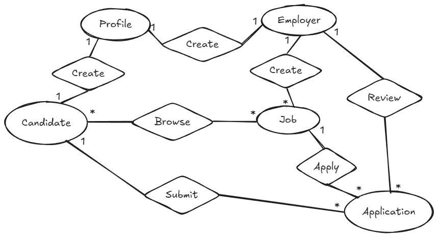
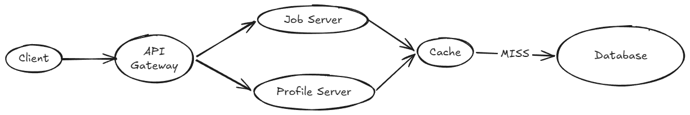
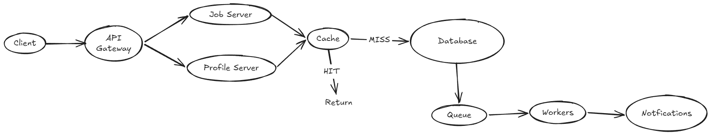

# Wahdy_Aref_Howa_Da_Dor_ElBotola

---

# 1. Functional Requrmints
  1.	Candidates should specify their skills, experience, education, career goals, and portfolio.
  2.	Employers should display company information, open positions, and other relevant details.
  3.	System should allow employers create job posting
  4.	System should recommend jobs to candidates & candidates to employers
  5.	System should allow candidates to browse jobs
  6.	System should allow employers to review applications
  7.	System shall prevent duplicates & conflict applications
  8.	System should compare candidates according to skills & tell them skills they miss
  9.	System should send notifications for new job matches

---

# 2. Non-Functional Requrmints
  1.	Low Latency in searching
  2.	Reliability
  3.	Support large number of Daily Users

---

# 3. Data Model

  Entities: Candidate - Employer - Job - Profile - Application
  

---

# 4. API Design

  ### Create Profile
  POST/profile  
  body:{  
    "name": string,  
    "skills": string[]  
  }  

  ### Get Profile
  GET/profile/{profile_id} -> profile

  ### Get Jobs
  GET/jobs -> jobs[]

  ### Create Job
  POST/jobs  
  body:{  
    "content": string  
  }  

---

# 5. High Level Archeticture
  Client go to the API Gateway and move it according to the request to the profile server or Jobs Server and get or add to the database
  

---

# 6. Deep Dive

  For better performance we can use caching & queue and we will discuss the use of each one of them  
  
  1. Cache usage here is for getting profile and jobs  
  If this user opened this job or profile for the first time it come from database and save it in cache so in the second time he wants to see it, it's saved in cache so it will not take more time to response  
  
  2. Queue usage here is for something that don't need to be done right now, like notifications or a post for a famous employer that will be shared for millions we can put it in the queue to not make the system crash or be more latency so after we do the operation we put it in the queue and workers work in it parallel to the main work of the system
